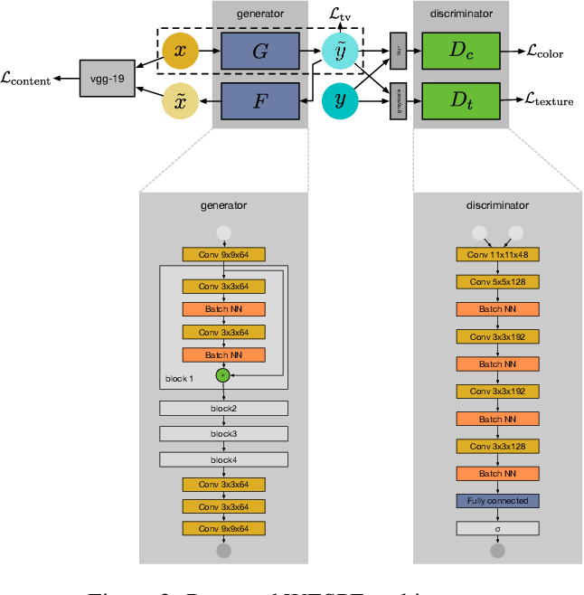

# WESPE: Weakly Supervised Photo Enhancer for Digital Cameras
PyTorch implementation of paper:
https://arxiv.org/abs/1709.01118

## Common paper idea
This article about the method of enhancing photos.

The main goal is simple: mapping from source X(bad quality pictures) to target Y(well quality pictures) in weakly supervised manner, that means we don't need a dataset of exact pairs (x, y). Here is the whole architecture and it can be divided into two parts:

* In the first part we use two generators. The first one is for X -> enhanced_Y and the second one is enhaced_Y -> reconstructed_X as shown in the picture above. And then we calculate content loss based on pre-trained VGG-19. In simple words we try to map X into Y and make it without content loss, that's why we calculate the loss of composition of these functions. 

* In the second part we use two adversarial discriminators and total variation(for smoother results). The first one for color loss and the second one for texture loss. Here the idea is next: we want that enhanced pictures have similar color and texture distributions as good pictures. The final loss is a linear combination of all these losses.